# JobPilot Architecture

## System Overview

JobPilot is an AI-powered local job application assistant that automates the full cycle of job hunting: discovery, relevance scoring, CV tailoring, and application submission. The user configures their profile and search preferences once, then triggers a morning batch that scrapes enabled job boards, scores raw listings against their criteria using a weighted keyword and recency model, tailors their LaTeX CV for each top match using Gemini 2.0 Flash, and queues the results for the user to review and apply with one click. The entire system runs as a single local process — a FastAPI backend serving both the REST API and the compiled SvelteKit frontend — backed by a SQLite database and the Tectonic LaTeX compiler.

The backend is structured around a lifespan-managed set of singleton services stored on `app.state`. There is no service mesh, no message broker, and no background worker process separate from the main event loop. Async SQLAlchemy with WAL-mode SQLite handles all persistence; real-time push notifications to the browser use a single persistent WebSocket connection managed by a `ConnectionManager`. The design philosophy optimises for local, single-user simplicity: no authentication layer, no container orchestration, no cloud services beyond the Gemini and Adzuna APIs.

The two most structurally significant design choices are the two-tier scraping and the two-tier apply architectures, both of which follow the same pattern: a fast, deterministic Tier 1 path (Scrapling HTTP fetcher for scraping; Playwright direct form-fill for applying) is attempted first, and the system falls back to a powerful but slower Tier 2 path (browser-use LLM agent) when Tier 1 returns empty results or raises an exception. This makes the system both economical under normal conditions and robust against bot-detection and unusual page structures.

---

## Component Diagram

```mermaid
graph TD
    subgraph Frontend ["Frontend (SvelteKit, port 5173 dev / same-origin prod)"]
        UI["Browser UI\n(+page.svelte routes)"]
        WS_CLIENT["WebSocket Client\n(websocket.ts store)"]
    end

    subgraph Backend ["Backend (FastAPI + Uvicorn, port 8000)"]
        direction TB

        subgraph API ["API Layer (backend/api/)"]
            JOBS["jobs.py\n/api/jobs"]
            QUEUE["queue.py\n/api/queue"]
            APPS["applications.py\n/api/applications"]
            DOCS["documents.py\n/api/documents"]
            SETTINGS["settings.py\n/api/settings"]
            ANALYTICS["analytics.py\n/api/analytics"]
            WS_SERVER["ws.py\n/ws (WebSocket)"]
            HEALTH["GET /api/health"]
        end

        subgraph Services ["Domain Services (app.state singletons)"]
            ORCHESTRATOR["ScrapingOrchestrator"]
            MATCHER["JobMatcher"]
            CV_PIPELINE["CVPipeline"]
            LETTER_PIPELINE["LetterPipeline"]
            APPLY_ENGINE["ApplicationEngine"]
            SCHEDULER["MorningBatchScheduler"]
            SESSION_MGR["BrowserSessionManager"]
        end

        subgraph Scraping ["Scraping (backend/scraping/)"]
            SCRAPLING["ScraplingFetcher\n(Tier 1: HTTP + 1 LLM call)"]
            ADAPTIVE["AdaptiveScraper\n(Tier 2: browser-use agent)"]
            ADZUNA_CLIENT["AdzunaClient\n(REST API)"]
            DEDUP["JobDeduplicator\n(MD5 hash)"]
            SITE_PROMPTS["site_prompts.py\n(SITE_CONFIGS, prompts)"]
        end

        subgraph LLM ["LLM (backend/llm/)"]
            GEMINI["GeminiClient\n(15 RPM limiter, fallback models)"]
            ANALYZER["JobAnalyzer"]
            MODIFIER["CVModifier"]
            EDITOR["CVEditor (letter)"]
        end

        subgraph LaTeX ["LaTeX (backend/latex/)"]
            COMPILER["LaTeXCompiler\n(Tectonic subprocess)"]
            APPLICATOR["CVApplicator\n(safety-gated replacements)"]
            INJECTOR["LaTeXInjector\n(marker-based letter edits)"]
            PARSER["LaTeXParser"]
        end

        subgraph Applier ["Applier (backend/applier/)"]
            AUTO["AutoApplyStrategy\n(Tier 1 → Tier 2)"]
            ASSISTED["AssistedApplyStrategy"]
            MANUAL["ManualApplyStrategy"]
            FORM_FILLER["PlaywrightFormFiller\n(Tier 1)"]
            CAPTCHA["CaptchaHandler"]
            DAILY_LIMIT["DailyLimitGuard"]
        end

        DB["SQLite DB\n(jobpilot.db, WAL mode)"]
    end

    subgraph External ["External Services"]
        GEMINI_API["Google Gemini API"]
        ADZUNA_API["Adzuna Jobs API"]
        JOB_BOARDS["Job Boards\n(LinkedIn, Indeed, etc.)"]
        TECTONIC_BIN["Tectonic Binary\n(LaTeX compiler)"]
    end

    UI -->|REST HTTP| JOBS & QUEUE & APPS & DOCS & SETTINGS & ANALYTICS
    UI -.->|WebSocket| WS_CLIENT
    WS_CLIENT <-->|ws://host/ws| WS_SERVER

    QUEUE -->|triggers| SCHEDULER
    APPS -->|calls| APPLY_ENGINE
    DOCS -->|reads PDF from| DB

    SCHEDULER --> ORCHESTRATOR
    SCHEDULER --> MATCHER
    SCHEDULER --> CV_PIPELINE

    ORCHESTRATOR --> SCRAPLING
    ORCHESTRATOR --> ADAPTIVE
    ORCHESTRATOR --> ADZUNA_CLIENT
    ORCHESTRATOR --> DEDUP
    ORCHESTRATOR --> SESSION_MGR

    SCRAPLING -->|HTML fetch| JOB_BOARDS
    ADAPTIVE -->|browser-use agent| JOB_BOARDS
    ADZUNA_CLIENT -->|REST| ADZUNA_API

    SCRAPLING --> GEMINI
    ADAPTIVE --> GEMINI_API
    GEMINI --> GEMINI_API

    CV_PIPELINE --> ANALYZER
    CV_PIPELINE --> MODIFIER
    CV_PIPELINE --> APPLICATOR
    CV_PIPELINE --> COMPILER

    LETTER_PIPELINE --> EDITOR
    LETTER_PIPELINE --> INJECTOR
    LETTER_PIPELINE --> COMPILER

    ANALYZER --> GEMINI
    MODIFIER --> GEMINI
    EDITOR --> GEMINI

    COMPILER -->|subprocess| TECTONIC_BIN

    APPLY_ENGINE --> AUTO & ASSISTED & MANUAL
    AUTO --> FORM_FILLER
    AUTO --> CAPTCHA
    ASSISTED --> FORM_FILLER
    FORM_FILLER --> GEMINI
    APPLY_ENGINE --> DAILY_LIMIT

    WS_SERVER -->|broadcast| WS_CLIENT

    JOBS & QUEUE & APPS & DOCS & SETTINGS & ANALYTICS & SCHEDULER & APPLY_ENGINE --> DB
```



---

## Request Lifecycles

### Morning Batch Flow

1. **Trigger** — The user clicks "Scan for Jobs" in the UI, which fires `POST /api/queue/refresh`. The `queue.py` router retrieves the `MorningBatchScheduler` singleton from `app.state` and spawns `scheduler.run_batch()` as an `asyncio.create_task()`, returning `{"status": "started"}` immediately.

2. **Settings load** — `_run_batch_inner` opens a DB session and reads the single `SearchSettings` row (keywords, locations, countries, salary_min, min_match_score, daily_limit, batch_time) and the single `UserProfile` row (base_cv_path). All enabled `JobSource` rows are also fetched. A WebSocket `scraping_status` broadcast marks 5% progress.

3. **Scraping — Phase 1 (API sources)** — `ScrapingOrchestrator.run_morning_batch()` runs all `type="api"` sources (currently only Adzuna) in parallel via `asyncio.gather`. `AdzunaClient.search()` calls the Adzuna REST API, maps results to `RawJob` objects, and returns them.

4. **Scraping — Phase 2 (browser sources)** — For each `type="browser"` source (LinkedIn, Indeed, Google Jobs, Welcome to the Jungle, Glassdoor), and for each keyword, the orchestrator attempts Tier 1 first: `ScraplingFetcher.scrape_job_listings()` fetches the page HTML via Scrapling's stealthy HTTP client, cleans it to ≤30,000 characters of markdown, and calls `GeminiClient.generate_text()` once to extract structured JSON. If Tier 1 returns zero results or raises, the orchestrator falls back to Tier 2: `AdaptiveScraper.scrape_job_listings()` launches a browser-use agent backed by Gemini, navigates the board autonomously (up to 20 steps, 180 s), and returns parsed `RawJob` objects. WebSocket progress messages are broadcast between sources (35%–60%).

5. **Scraping — Phase 3 (lab URL sources)** — All `type="lab_url"` sources (custom company/research-lab URLs added by the user) are scraped in parallel using Tier 2 only (AdaptiveScraper). WebSocket progress reaches 75% after this phase.

6. **Deduplication** — All `RawJob` lists are concatenated and passed to `JobDeduplicator.deduplicate()`, which hashes each job by MD5 of `company|title|location` (normalised), keeping the copy with the longest description when duplicates are found.

7. **Matching and ranking** — Each deduplicated `RawJob` is converted to a `JobDetails` DTO and scored by `JobMatcher.score()` against the loaded `JobFilters`. Jobs scoring below `min_match_score` are discarded. Survivors are sorted by score descending. WebSocket progress reaches 35%.

8. **DB persistence** — `_store_matches()` upserts each `Job` row by its dedup hash (updating description and apply_url if the new data is richer), then creates or updates a `JobMatch` row with `status="new"`, `score`, and `batch_date=today`. Commit is issued after all rows are written. WebSocket progress reaches 55%.

9. **CV pre-generation** — `DailyLimitGuard.remaining_today()` determines how many CV slots remain for the day. The top N matches (N = remaining slots) receive pre-generated CVs: `CVPipeline.generate_tailored_cv()` is called for each, with up to 3 concurrent Gemini calls (controlled by `asyncio.Semaphore(3)`). Inside the pipeline, `JobAnalyzer.analyze()` calls Gemini to extract a `JobContext`, `CVModifier.modify()` calls Gemini to suggest ≤3 surgical LaTeX replacements, `CVApplicator.apply()` validates and applies them, and Tectonic compiles the resulting `.tex` to PDF. The resulting paths and diff are stored as `TailoredDocument` rows. WebSocket progress climbs from 65% to 95%.

10. **Dashboard notification** — A final WebSocket broadcast (`progress=1.0`, message "N applications ready for review") signals the frontend to reload the queue. The UI's queue page re-fetches `GET /api/queue` and displays the new matches.

---

### Apply Flow

1. **User action** — On the Job Detail page (`/jobs/[id]`), the user clicks "Auto Apply", "Assisted Apply", or "Open & Apply". The frontend POSTs to `POST /api/applications/{match_id}/apply` with a JSON body containing `method`, applicant personal data (`full_name`, `email`, `phone`, `location`), and optionally `additional_answers_json`.

2. **API layer** — `applications.py` validates the request. It queries the `TailoredDocument` table to resolve the CV PDF path (`doc_type="cv"`) and cover-letter PDF path (`doc_type="letter"`) for the given `match_id`. It also resolves `apply_url` from `Job.apply_url` or `Job.url` if not provided in the request. The handler then calls `ApplicationEngine.apply()`.

3. **Daily limit check** — For `auto` and `assisted` modes, `DailyLimitGuard.assert_can_apply()` queries `Application` rows with `applied_at >= today` and `status IN ('applied', 'pending')`. If the daily cap (hardcoded to 10) is exhausted, a `DailyLimitExceeded` exception cancels the request.

4. **Concurrency guard** — The engine checks `_in_flight` to prevent two simultaneous apply attempts for the same `job_match_id`. If already in flight, the request returns `status="cancelled"` immediately.

5. **Strategy selection** — Based on `ApplyMode`, the engine dispatches to one of three strategies:

   - **AUTO (`AutoApplyStrategy`)**: If `APPLY_TIER1_ENABLED`, attempts `PlaywrightFormFiller.fill_and_submit()` (Tier 1). The form filler launches a persistent Chromium context (with per-domain saved cookies), optionally applies stealth patches, navigates to the apply URL, checks for CAPTCHA, cleans the page HTML to a ≤15,000-character form skeleton, calls Gemini once to get a JSON field mapping (selectors → values), fills all fields, takes a screenshot, and broadcasts an `apply_review` WebSocket message. Execution then blocks waiting for the user to send `confirm_submit` or `cancel_apply` over the WebSocket (30-minute timeout). If confirmed, the submit button is clicked. If Tier 1 raises at any point, execution falls through to the Tier 2 browser-use agent path, which similarly pauses for review before submitting.

   - **ASSISTED (`AssistedApplyStrategy`)**: Tier 1 calls `PlaywrightFormFiller.fill_only()`, which fills all fields but intentionally leaves the browser open (context is set to `None` before cleanup). Tier 2 runs a browser-use agent with explicit instructions not to submit. The browser remains visible for the user to review and submit manually.

   - **MANUAL (`ManualApplyStrategy`)**: Opens `apply_url` in the system default browser via `webbrowser.open()`. No automation occurs.

6. **DB persistence** — Regardless of outcome, `_record_application()` inserts an `Application` row (`job_match_id`, `method`, `status`, `applied_at`) and an initial `ApplicationEvent` row, then commits.

7. **WebSocket broadcast** — An `apply_result` WebSocket message is broadcast with `job_id`, `status`, and `method`, allowing the frontend to update its state and show the result to the user.

---

### CV Tailoring Flow

1. **Job selected** — When the morning batch identifies a top-scoring `JobMatch`, or when a user manually triggers document regeneration via `POST /api/documents/{match_id}/regenerate`, the CV pipeline is invoked with the `JobDetails` and the path to the base CV `.tex` file.

2. **File staging** — `CVPipeline.generate_tailored_cv()` copies the base `.tex` file and all sibling support files (`.cls`, `.sty`, image files) into a job-scoped output directory under `{data_dir}/cvs/{match_id}/`.

3. **Job analysis (LLM call 1)** — `JobAnalyzer.analyze()` sanitizes the job title (≤300 chars), company (≤200 chars), and description (≤2,000 chars), formats the `JOB_ANALYZER_PROMPT` template with those values, and calls `GeminiClient.generate_json()` with the `JobContext` Pydantic schema. Gemini returns a structured JSON object with required skills, nice-to-have skills, domain keywords, candidate matches, candidate gaps, locked fields, and suggested edit targets. The result is cached per `job.id` (1-hour TTL, 100-entry cap) to avoid redundant LLM calls.

4. **CV modification (LLM call 2)** — `CVModifier.modify()` serializes the `JobContext` to markdown via `JobContext.to_markdown()` and formats the `CV_MODIFIER_SKILL` prompt with both the context and the full LaTeX source (truncated at 50,000 chars). `GeminiClient.generate_json()` is called with the `CVModifierOutput` schema. Gemini returns a list of `CVReplacement` objects — each specifying a section, the exact original substring, the replacement text, a rationale, the job requirement matched, and a confidence score (0–1).

5. **Safety-gated application** — `CVApplicator.apply()` filters the replacements: only those with confidence ≥ 0.7 whose `original_text` is a verbatim substring of the current LaTeX source and whose `replacement_text` introduces no new LaTeX commands pass the gate. At most 3 replacements (highest confidence) are applied using `str.replace(..., 1)`.

6. **LaTeX injection (letters)** — For the cover letter, `LetterPipeline.generate_tailored_letter()` follows a parallel path: `LaTeXParser.extract_sections()` finds JOBPILOT marker-delimited regions in the `.tex` file, `CVEditor.edit_letter()` calls Gemini to produce a customized paragraph (with a post-edit safety check that rejects any output introducing new LaTeX commands), and `LaTeXInjector.inject_letter_edit()` replaces the content between the `LETTER:PARA` markers.

7. **Tectonic compilation** — `LaTeXCompiler.compile()` runs the Tectonic binary as an async subprocess (`asyncio.create_subprocess_exec`) with `--outdir <output_dir>`. Tectonic handles all package downloads automatically. A `LaTeXCompilationError` is raised if the binary is not found or exits non-zero.

8. **PDF storage** — The resulting `.tex` and `.pdf` paths, plus the `diff` list of `DiffEntry` records describing what changed, are stored in a `TailoredDocument` row linked to the `JobMatch` by `job_match_id`. The diff is serialized as JSON in `diff_json`. The frontend can retrieve the PDF via `GET /api/documents/{match_id}/cv/pdf` and view the diff via `GET /api/documents/{match_id}/diff`.

---

## Module Responsibilities

**Config and startup (`backend/config.py`, `backend/main.py`)** — `config.py` defines the `Settings` pydantic-settings class and exposes a single `settings` singleton consumed everywhere. Three fields (`GOOGLE_API_KEY`, `ADZUNA_APP_ID`, `ADZUNA_APP_KEY`) have no defaults and cause a fatal `ValidationError` at startup if absent. `main.py` constructs the FastAPI application, registers middleware and all API routers, implements the `lifespan` async context manager that sequences startup (data directory creation → DB init → singleton construction → WebSocket handler wiring), and mounts the compiled SvelteKit frontend as a SPA static-files handler with correct cache-control headers.

**Database (`backend/database.py`)** — Builds the async SQLAlchemy infrastructure: an async engine backed by `sqlite+aiosqlite` in WAL mode, an `AsyncSessionLocal` session factory, and two session access patterns (`db_session()` for service code with auto-commit/rollback, `get_db()` for FastAPI `Depends` injection). Provides `init_db()` which runs `Base.metadata.create_all` and seeds the `job_sources` table from `SITE_CONFIGS` on first run.

**Models (`backend/models/`)** — Defines all SQLAlchemy ORM models (`UserProfile`, `SearchSettings`, `SiteCredential`, `JobSource`, `Job`, `JobMatch`, `TailoredDocument`, `Application`, `ApplicationEvent`, `BrowserSession`) and the Pydantic DTOs (`RawJob`, `JobDetails`) used in-memory between the scraping, matching, and LLM layers. All foreign key relationships are application-enforced only; no database-level FK constraints exist.

**API (`backend/api/`)** — Thin FastAPI routers organized by domain vertical. Each router validates input, calls into domain services, reads from and writes to the database via injected `AsyncSession`, and serialises results with Pydantic response models. No business logic lives in the API layer that belongs elsewhere. The WebSocket module (`ws.py`) manages all real-time connections via a `ConnectionManager` with an `asyncio.Lock`-protected connection dict, dispatches inbound messages to registered handlers, and exposes the `broadcast_status` helper used by scraping and scheduling modules.

**Scraping (`backend/scraping/`)** — The job-discovery engine. `ScrapingOrchestrator` coordinates three phases of scraping (API → browser → lab URLs) and deduplication. `ScraplingFetcher` (Tier 1) fetches pages via Scrapling's HTTP client, converts HTML to clean markdown, and calls Gemini once per site/keyword to extract structured job data. `AdaptiveScraper` (Tier 2) uses the browser-use LLM agent loop to navigate pages autonomously. `BrowserSessionManager` maintains persistent Playwright browser sessions per job board, supporting both auto-login (LinkedIn, Indeed) and manual login flows via the WebSocket UI. `AdzunaClient` wraps the Adzuna REST API. `JobDeduplicator` deduplicates in-memory by MD5 hash.

**LLM (`backend/llm/`)** — JobPilot's interface to Google Gemini. `GeminiClient` wraps the `google-genai` SDK with a 15 RPM sliding-window rate limiter, primary-plus-fallback model chain, exponential back-off on 429 responses, and self-healing JSON retry. `JobAnalyzer` extracts structured skill and keyword data from job descriptions. `CVModifier` produces surgical LaTeX text replacements guided by the `JobContext`. `CVEditor` customizes the marker-delimited motivation-letter paragraph. All prompts wrap untrusted external data in `<untrusted_data>` XML tags.

**LaTeX (`backend/latex/`)** — The CV tailoring pipeline. `CVPipeline` orchestrates `JobAnalyzer` → `CVModifier` → `CVApplicator` → Tectonic for CV documents. `LetterPipeline` uses `LaTeXParser` → `CVEditor` → `LaTeXInjector` → Tectonic for cover letters. `CVApplicator` is the safety gate that validates each LLM-proposed replacement (confidence ≥ 0.7, verbatim match, no new LaTeX commands) and caps applied replacements at three. `LaTeXCompiler` wraps Tectonic as an async subprocess. `LaTeXParser` extracts JOBPILOT marker-delimited sections from `.tex` files.

**Applier (`backend/applier/`)** — Executes job applications. `ApplicationEngine` enforces the daily limit, prevents concurrent in-flight applies to the same job, and dispatches to the correct strategy. `AutoApplyStrategy` (Tier 1: `PlaywrightFormFiller`; Tier 2: browser-use agent) pauses before submission for user review via WebSocket. `AssistedApplyStrategy` fills the form and leaves the browser open for manual submission. `ManualApplyStrategy` opens the URL in the system browser. `CaptchaHandler` detects and manages CAPTCHA challenges during apply flows.

**Scheduler (`backend/scheduler/`)** — `MorningBatchScheduler` orchestrates the full five-step batch pipeline (scrape → match → store → pre-generate CVs → notify). Although it wraps an `AsyncIOScheduler` with a configurable `CronTrigger`, auto-start is currently disabled; the batch runs only on explicit user action via `POST /api/queue/refresh`. CV pre-generation is parallelised with a concurrency cap of 3 via `asyncio.Semaphore`.

**Frontend (`frontend/`)** — A SvelteKit 5 (Svelte runes) single-page application. Pages are: Job Queue (daily matches, apply buttons, WebSocket review modal), Job Detail (apply actions, CV diff view), Tracker (Kanban board of application outcomes), CV Manager (template upload, tailored CV history), Settings (six-tab hub for profile/search/sites/credentials/sources/system), Analytics (stats cards and daily trend chart). All HTTP calls go through a typed `apiFetch<T>` helper; the WebSocket connection is shared via a Svelte store with automatic 3-second reconnect.

---

## Database Schema

### `user_profile`

| Column | Type | Constraints | Description |
|---|---|---|---|
| `id` | INTEGER | PK, default=1 | Singleton row identifier |
| `full_name` | STRING | NOT NULL | Candidate's display name |
| `email` | STRING | NOT NULL | Contact email |
| `phone` | STRING | nullable | Phone number |
| `location` | STRING | nullable | Current location |
| `base_cv_path` | STRING | nullable | Filesystem path to base `.tex` CV template |
| `base_letter_path` | STRING | nullable | Filesystem path to base `.tex` letter template |
| `additional_info` | JSON | nullable | Freeform dict (e.g. LinkedIn URL) |
| `created_at` | DATETIME | NOT NULL, default=utcnow | Row creation timestamp |
| `updated_at` | DATETIME | NOT NULL, default=utcnow | Last update timestamp (not auto-refreshed on update) |

### `search_settings`

| Column | Type | Constraints | Description |
|---|---|---|---|
| `id` | INTEGER | PK, default=1 | Singleton row identifier |
| `keywords` | JSON | NOT NULL | Include-list; stored as `{"include": [...]}` or bare list |
| `excluded_keywords` | JSON | nullable | Keywords that disqualify a job |
| `locations` | JSON | nullable | Target city/region list |
| `salary_min` | INTEGER | nullable | Minimum acceptable salary |
| `experience_min` | INTEGER | nullable | Minimum years of experience (stored, not yet used in matching) |
| `experience_max` | INTEGER | nullable | Maximum years of experience (stored, not yet used) |
| `remote_only` | BOOLEAN | NOT NULL, default=False | Restrict to remote positions |
| `job_types` | JSON | nullable | e.g. `{"types": ["full-time"]}` (stored, not yet used) |
| `languages` | JSON | nullable | Language preference (stored, not yet used) |
| `excluded_companies` | JSON | nullable | Company names to skip |
| `daily_limit` | INTEGER | NOT NULL, default=10 | Max applications per day |
| `batch_time` | STRING | NOT NULL, default="08:00" | Scheduled run time HH:MM (APScheduler disabled; currently unused at runtime) |
| `min_match_score` | FLOAT | NOT NULL, default=30.0 | Jobs below this score are discarded |
| `countries` | JSON | nullable | Country codes for scraping; added post-migration, relies on `create_all` |

### `site_credentials`

| Column | Type | Constraints | Description |
|---|---|---|---|
| `id` | INTEGER | PK, autoincrement | — |
| `site_name` | STRING | NOT NULL, UNIQUE | Job board identifier (e.g. `"linkedin"`) |
| `encrypted_email` | STRING | nullable | Fernet-encrypted login email |
| `encrypted_password` | STRING | nullable | Fernet-encrypted login password |
| `created_at` | DATETIME | NOT NULL, default=utcnow | — |
| `updated_at` | DATETIME | NOT NULL, default=utcnow | Not auto-refreshed on update |

### `job_sources`

| Column | Type | Constraints | Description |
|---|---|---|---|
| `id` | INTEGER | PK, autoincrement | — |
| `name` | STRING | NOT NULL | Site key (e.g. `"linkedin"`, `"adzuna"`) |
| `type` | STRING | NOT NULL | `"api"`, `"browser"`, or `"lab_url"` |
| `url` | STRING | nullable | Base URL for browser/lab sources |
| `config` | JSON | nullable | Source-specific config (e.g. `{"country": "fr"}`) |
| `prompt_template` | TEXT | nullable | Override prompt for this source |
| `enabled` | BOOLEAN | NOT NULL, default=True | Whether this source is active |
| `last_scraped_at` | DATETIME | nullable | Timestamp of last successful scrape |
| `created_at` | DATETIME | NOT NULL, default=utcnow | — |

### `jobs`

| Column | Type | Constraints | Description |
|---|---|---|---|
| `id` | INTEGER | PK, autoincrement | — |
| `source_id` | INTEGER | nullable, logical FK → `job_sources.id` | Which source produced this job |
| `external_id` | STRING | nullable | Job board's own identifier |
| `title` | STRING | NOT NULL | Job title |
| `company` | STRING | NOT NULL | Employer name |
| `location` | STRING | nullable | Job location string |
| `country` | STRING | nullable | ISO country code |
| `salary_text` | STRING | nullable | Raw salary string from the board |
| `salary_min` | INTEGER | nullable | Parsed minimum salary |
| `salary_max` | INTEGER | nullable | Parsed maximum salary |
| `description` | TEXT | nullable | Full job description |
| `requirements` | JSON | nullable | Structured requirements list |
| `benefits` | JSON | nullable | Structured benefits list |
| `url` | STRING | NOT NULL | Job listing URL |
| `apply_url` | STRING | nullable | Direct application URL |
| `apply_method` | STRING | nullable | e.g. `"easy_apply"`, `"form"`, `"manual"` |
| `posted_at` | DATETIME | nullable | When the job was originally posted |
| `scraped_at` | DATETIME | NOT NULL, default=utcnow | When JobPilot ingested this job |
| `dedup_hash` | STRING | nullable, UNIQUE | MD5 of normalised `company\|title\|location` |
| `raw_data` | JSON | nullable | Original parsed JSON from the scraper |

### `job_matches`

| Column | Type | Constraints | Description |
|---|---|---|---|
| `id` | INTEGER | PK, autoincrement | — |
| `job_id` | INTEGER | NOT NULL, logical FK → `jobs.id` | The matched job |
| `score` | FLOAT | NOT NULL | Weighted match score |
| `keyword_hits` | JSON | nullable | Per-keyword hit breakdown |
| `status` | STRING | NOT NULL, default="new" | `"new"`, `"skipped"`, `"applying"`, `"applied"`, `"rejected"` |
| `batch_date` | DATE | nullable | Calendar date of the batch run that produced this match |
| `matched_at` | DATETIME | NOT NULL, default=utcnow | When the match was created |

### `tailored_documents`

| Column | Type | Constraints | Description |
|---|---|---|---|
| `id` | INTEGER | PK, autoincrement | — |
| `job_match_id` | INTEGER | nullable, logical FK → `job_matches.id` | The associated match |
| `doc_type` | STRING | NOT NULL | `"cv"` or `"letter"` |
| `tex_path` | STRING | nullable | Absolute path to the generated `.tex` file |
| `pdf_path` | STRING | nullable | Absolute path to the compiled `.pdf` file |
| `diff_json` | JSON | nullable | List of `DiffEntry` records (section, original, edited, description) |
| `llm_prompt` | TEXT | nullable | The prompt sent to Gemini (for auditability) |
| `llm_response` | TEXT | nullable | The raw Gemini response (for auditability) |
| `created_at` | DATETIME | NOT NULL, default=utcnow | — |

### `applications`

| Column | Type | Constraints | Description |
|---|---|---|---|
| `id` | INTEGER | PK, autoincrement | — |
| `job_match_id` | INTEGER | nullable, logical FK → `job_matches.id` | The match this application is for |
| `method` | STRING | NOT NULL | `"auto"`, `"assisted"`, or `"manual"` |
| `status` | STRING | NOT NULL, default="pending" | `"pending"`, `"applied"`, `"cancelled"`, `"failed"`, `"interview"`, `"offer"`, `"rejected"` |
| `applied_at` | DATETIME | nullable | When the application was submitted |
| `notes` | STRING | nullable | Freeform notes |
| `error_log` | TEXT | nullable | Error details on failure |
| `created_at` | DATETIME | NOT NULL, default=utcnow | — |

### `application_events`

| Column | Type | Constraints | Description |
|---|---|---|---|
| `id` | INTEGER | PK, autoincrement | — |
| `application_id` | INTEGER | NOT NULL, logical FK → `applications.id` | The parent application |
| `event_type` | STRING | NOT NULL | e.g. `"submitted"`, `"interview"`, `"offer"`, `"rejected"`, `"captcha_detected"` |
| `details` | STRING | nullable | Human-readable detail |
| `event_date` | DATETIME | NOT NULL, default=utcnow | When the event occurred |

### `browser_sessions`

| Column | Type | Constraints | Description |
|---|---|---|---|
| `id` | INTEGER | PK, autoincrement | — |
| `site_name` | STRING | NOT NULL, UNIQUE | Job board identifier |
| `storage_state_path` | STRING | nullable | Path to Playwright `state.json` |
| `last_used_at` | DATETIME | nullable | Last access timestamp |
| `expires_at` | DATETIME | nullable | Session expiry timestamp |

### Foreign Key Relationships (application-enforced only, no DB-level constraints)

| Child Table | Column | Logical Parent |
|---|---|---|
| `jobs` | `source_id` | `job_sources.id` |
| `job_matches` | `job_id` | `jobs.id` |
| `tailored_documents` | `job_match_id` | `job_matches.id` |
| `applications` | `job_match_id` | `job_matches.id` |
| `application_events` | `application_id` | `applications.id` |

---

## Key Design Decisions

- **Async SQLAlchemy + SQLite (WAL mode)**: SQLite avoids all operational overhead of a server database for a local single-user tool. WAL journal mode allows concurrent reads during writes, which matters because the scheduler writes jobs while the API layer reads them. `expire_on_commit=False` on the session factory keeps ORM objects usable after commits without re-fetching, which simplifies async code that accesses attributes after a commit.

- **No database-level foreign key constraints**: SQLite FK enforcement (`PRAGMA foreign_keys=ON`) is not enabled. This was likely an oversight rather than a deliberate decision; the consequence is that orphaned rows accumulate silently when parent records are deleted. All relational integrity is maintained solely by application logic.

- **Gemini 2.0 Flash on the free tier**: The entire LLM workload — job analysis, CV modification, letter editing, Tier 1 scraping extraction, Tier 1 form-fill field mapping, and Tier 2 browser-use navigation — runs through a single Gemini model. The 15 RPM free-tier rate limit is enforced in-process by `GeminiClient` using a sliding-window deque. A primary-plus-fallback model chain allows the system to survive model deprecations without code changes.

- **Two-tier scraping architecture**: Tier 1 (Scrapling HTTP + one Gemini call) handles known job boards that can be scraped without a full browser, making each site/keyword pair cost roughly one API call and 10–30 seconds. Tier 2 (browser-use LLM agent, up to 20 steps) handles arbitrary URLs and serves as a fallback for Tier 1 failures. This mirrors a common pattern in web automation: fast path for known structures, agentic path for unknown ones.

- **Two-tier apply architecture**: The same Tier 1 / Tier 2 pattern is applied to form submission. Tier 1 (`PlaywrightFormFiller`) makes one Gemini call to map applicant data to CSS selectors, then fills fields programmatically — fast and deterministic. Tier 2 (browser-use agent) reasons over the live DOM step-by-step — slower but adaptable to unusual or multi-step forms.

- **browser-use for agentic browser control**: Rather than building a custom browser automation framework, JobPilot delegates complex multi-step web interactions to the `browser-use` library, which pairs Playwright with an LLM agent loop. This dramatically reduces the code needed to handle varied page structures at the cost of higher latency and LLM call consumption.

- **Tectonic for LaTeX compilation**: Tectonic is a self-contained LaTeX engine that downloads packages on demand and produces clean PDF output without requiring a full TeX distribution to be pre-installed. This makes dependency management simpler for a local tool. The compiler is wrapped as an async subprocess so compilation does not block the event loop.

- **No authentication layer**: The system is explicitly designed as a local single-user tool. Every API endpoint is fully unauthenticated. CORS is fully open (`allow_origins=["*"]`) with credentials allowed, which is a known development-only configuration that browsers reject in production. Network-level access control (binding to `127.0.0.1`) is the only security boundary.

- **Marker-based LaTeX editing**: Rather than parsing LaTeX ASTs, CV tailoring uses two complementary approaches: `CVApplicator` applies verbatim substring replacements (safe because it checks that the exact text exists and introduces no new LaTeX commands), while `LaTeXInjector` uses `% --- JOBPILOT:<MARKER>:START/END ---` comment pairs to delimit sections. This avoids the complexity and fragility of a full LaTeX parser while remaining safe enough for automated edits.

- **APScheduler present but auto-start disabled**: The full `CronTrigger` scheduling infrastructure is implemented but `scheduler.start()` is never called during the lifespan startup. Batch runs are on-demand only via `POST /api/queue/refresh`. This was a deliberate removal noted in a comment in `main.py`, likely to give users explicit control over when scraping occurs.

- **Fernet symmetric encryption for site credentials**: Login credentials (email + password) for job boards are encrypted at rest using Fernet (AES-128 CBC with HMAC-SHA256) keyed by `CREDENTIAL_KEY`. The encryption key is stored in the `.env` file, meaning local filesystem access is the security boundary for both the key and the database.

---

## Deployment

### Dependencies

| Dependency | Version | Notes |
|---|---|---|
| Python | 3.12+ | Required for `asyncio` and type hint features used |
| Node.js | 18+ | Required only to build the frontend; not needed at runtime |
| Tectonic | any | LaTeX compiler; place at `bin/tectonic` in the project root or ensure it is on `PATH`. Run `uv run python scripts/download_tectonic.py` to install automatically. |
| `uv` | any | Python package manager; used to install all Python dependencies from `pyproject.toml` |

### Required Environment Variables

Create a `.env` file at the project root with at minimum:

```
GOOGLE_API_KEY=<your Gemini API key from Google AI Studio>
ADZUNA_APP_ID=<your Adzuna application ID>
ADZUNA_APP_KEY=<your Adzuna API key>
```

### Optional Environment Variables

| Variable | Default | Purpose |
|---|---|---|
| `CREDENTIAL_KEY` | `""` | Fernet key for encrypting site credentials. Generate with `python -c "from cryptography.fernet import Fernet; print(Fernet.generate_key().decode())"`. Empty disables encryption. |
| `JOBPILOT_HOST` | `127.0.0.1` | Bind address for Uvicorn |
| `JOBPILOT_PORT` | `8000` | Listen port |
| `JOBPILOT_LOG_LEVEL` | `info` | Log verbosity: `debug`, `info`, `warning`, `error` |
| `JOBPILOT_SCRAPER_HEADLESS` | `true` | Set to `false` to watch browser interactions during development |
| `JOBPILOT_DATA_DIR` | `./data` | Root directory for all persistent data (DB, CVs, letters, browser profiles, logs). Resolved relative to the working directory at process start. |
| `GOOGLE_MODEL` | `gemini-3-flash-preview` | Primary Gemini model name |
| `GOOGLE_MODEL_FALLBACKS` | `""` | Comma-separated fallback model names |
| `SCRAPLING_ENABLED` | `true` | Set to `false` to disable Tier 1 HTTP scraping and always use the browser-use agent |
| `APPLY_TIER1_ENABLED` | `true` | Set to `false` to skip the Playwright form-filler and always use the browser-use agent for applies |

### Start Commands

**Install Python dependencies:**
```bash
uv sync
```

**Install Tectonic (if not on PATH):**
```bash
uv run python scripts/download_tectonic.py
```

**Build the frontend (required for production; optional in development):**
```bash
cd frontend && npm install && npm run build
```

**Start the backend:**
```bash
uv run uvicorn backend.main:app --host 127.0.0.1 --port 8000 --reload
```

**Start the frontend dev server (development only):**
```bash
cd frontend && npm run dev
```

In production, the FastAPI backend serves the compiled SvelteKit build from `frontend/build/` at `/` via `SPAStaticFiles`. In development, the SvelteKit dev server runs on port 5173 and proxies API calls to port 8000 via `VITE_API_BASE_URL`.

### Data Directory Layout

After first startup, `JOBPILOT_DATA_DIR` (default `./data`) will contain:

```
data/
├── jobpilot.db              # SQLite database
├── cvs/                     # Tailored CV .tex and .pdf files, one subdir per match ID
├── letters/                 # Tailored cover letter .tex and .pdf files
├── templates/               # User-uploaded base .tex templates
├── browser_sessions/        # Legacy Playwright session files (backward compat)
├── browser_profiles/        # Canonical per-domain Playwright storage-state directories
└── logs/                    # Application log files
```
